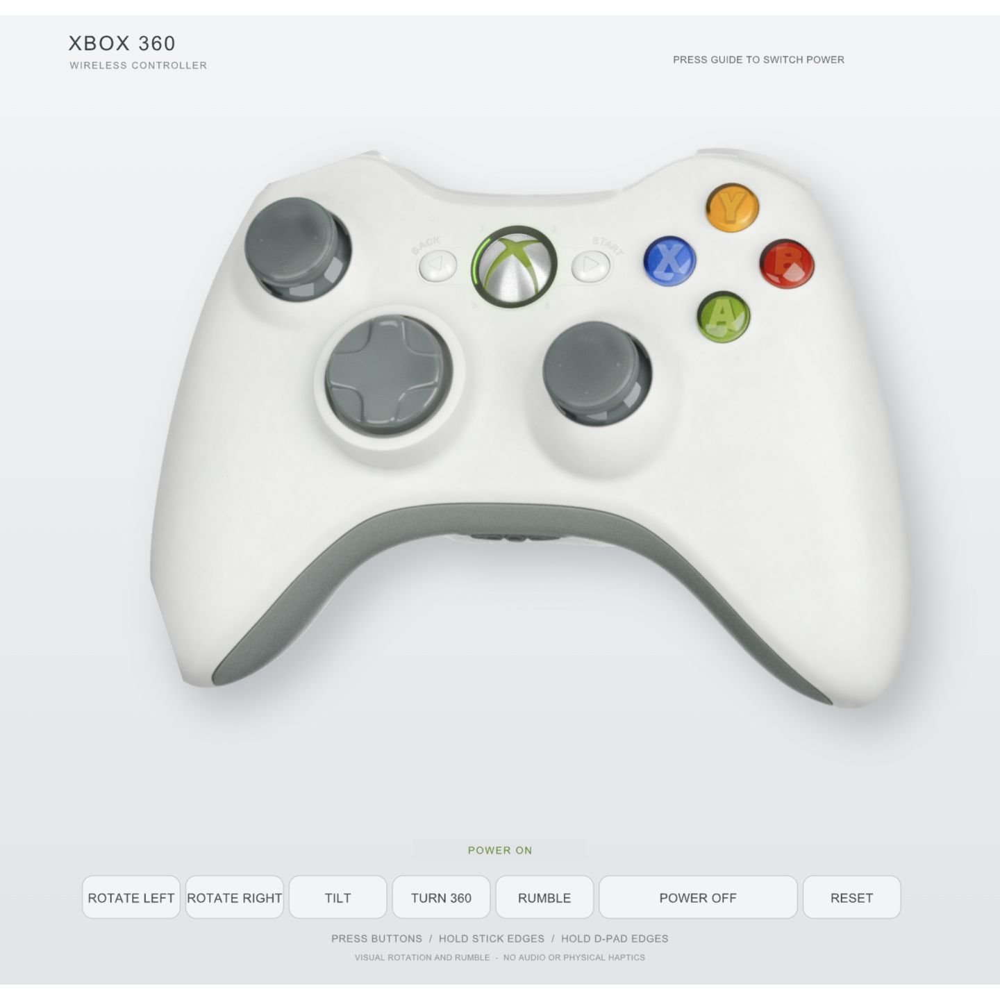

# Xbox 360 SVG Controller

An interactive Xbox 360 controller drawn entirely in SVG: measured vector shapes, procedural materials, and native SVG animation.

**[Open the live controller](https://chetaslua.github.io/xbox360-svg-controller/)** · **[View the SVG source](controller.svg)** · **[MIT license](LICENSE)**



## What is included

- A standalone, editable [`controller.svg`](controller.svg), with no JavaScript or external runtime dependencies.
- Translucent ABXY buttons, a chrome Guide button, rubber stick texture, shell shading, and outlined labels.
- Power-ring startup, button travel and spring return, stick and D-pad presses, roll, tilt, spin, and visual rumble.
- The editable [base artwork](source/controller-base.svg), [build script](tools/build.py), [material refinements](tools/material_refinement.py), and [source audit](tools/audit_svg.py).

The screenshot above is documentation only. It is **not embedded in, loaded by, or used to render the SVG**. The SVG contains no `<image>`, `<feImage>`, data URI, base64 asset, `<script>`, `<foreignObject>`, external font, or external resource. Texture and lighting come from native SVG paths, gradients, patterns, masks, and filters.

## Try it

Use the [live demo](https://chetaslua.github.io/xbox360-svg-controller/), or download `controller.svg` and open it directly in a modern browser. Open it as a document: embedding it through an HTML `` does not provide the same interactive behavior.

| Control | Action |
| --- | --- |
| Guide button / Power | Toggle the player ring and startup sequence |
| ABXY, Back, Start, stick centers | Press and release |
| Stick and D-pad edges | Hold a direction |
| Rotate Left / Right | Change the front-view roll angle |
| Tilt / Turn 360 | Animate the existing view |
| Rumble | Visual vibration while powered on |
| Reset | Restore the initial position and power state |

Focusable controls also support Enter. Rotation is two-dimensional and tilt is an affine transformation; this is not a reconstructed rear view or a 3D model. Rumble is visible movement, with no audio or physical haptics.

## Verify the code-only artwork

The audit uses only the Python standard library:

```sh
python3 tools/audit_svg.py
```

It checks forbidden elements, inline event-handler code, encoded assets, external references, duplicate IDs, missing paint/animation targets, and preservation of the original named geometry. It also verifies the separate README screenshot and prints the SVG's SHA-256 hash.

## Rebuild or modify

The checked-in SVG runs without installing anything. Rebuilding requires Python 3.10+ and FontTools:

```sh
python3 -m venv .venv
source .venv/bin/activate
python3 -m pip install -r requirements.txt
python3 tools/build.py
python3 tools/audit_svg.py
```

On Windows, activate with `.venv\Scripts\activate`. The builder finds Arial, Liberation Sans, or DejaVu Sans in common system locations. You can choose another TrueType font:

```sh
python3 tools/build.py --font /path/to/font.ttf
```

The font is used at build time to produce vector outlines for the control-panel labels; it is never loaded by the delivered SVG. The checked-in version uses Arial. Choosing a different font changes those label outlines. The base controller geometry is already fully outlined.

For a local preview of the included HTML host:

```sh
python3 -m http.server 8000
```

Then open `http://localhost:8000`. `index.html` hosts the standalone SVG in an `<object>` and adds source/download links; it contains no script.

## Provenance and license

Photo references informed the measured vector geometry. The artwork began with Claude-assisted generation and was refined in Codex. The screenshot is a capture of the delivered SVG with the controller rotated left and powered on.

Code and project documentation are released under the [MIT license](LICENSE). Xbox and Xbox 360 names and marks belong to Microsoft; this is an independent vector study.
