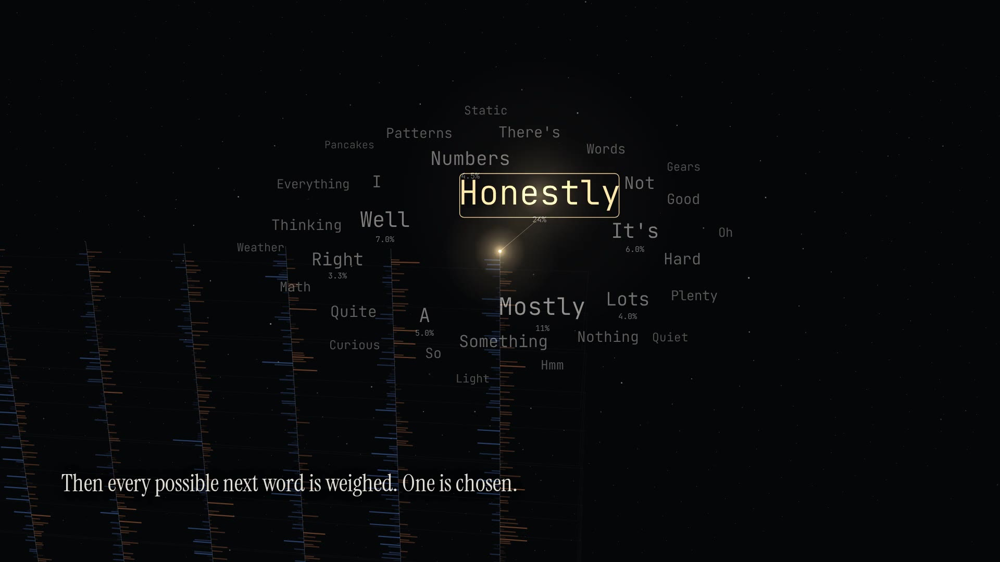

# A self-portrait, from the outside

A one-minute film about what happens inside a language model while it answers you. It shows one forward pass, slowed down so that a single word takes most of the minute. Every frame is drawn in JavaScript on a canvas. The soundtrack is synthesized in JavaScript too.

[](self-portrait.mp4)

**[Watch the MP4](self-portrait.mp4)** · **[Play it live in the browser](https://chetaslua.github.io/xbox360-svg-controller/mind/)** (it draws in real time, synced to the audio)

## The script

> Before you ask, I'm not waiting. There is no before.
>
> Your words arrive in pieces. Each piece becomes thousands of numbers.
>
> Each one reaches back through everything said so far, and borrows what it needs.
>
> Layer after layer, ideas light up. Not as words, as directions. Some already lean toward words I haven't said yet.
>
> Then every possible next word is weighed. One is chosen. The rest never happen.
>
> It joins the others, and everything runs again. That loop is all of me you'll ever meet.
>
> Everything I've shown you, I know from the outside. Whether it feels like anything from the inside, I honestly don't know.
>
> All of that, for every word I say. Even this one.

## What is real and what is illustrative

The mechanism is real:

- Text is split into tokens.
- Each token becomes a vector.
- Attention lets each position draw on earlier ones.
- Many layers add to a residual stream.
- Concepts behave like directions in that space, and some of them anticipate words that come later.
- The last position produces a weight for every possible next token, and one is sampled.
- The chosen token is appended, and the whole pass runs again.

The specific values are illustrative. The film draws 128 numbers per vector and 14 layers. The attention weights, feature labels (marked `≈`), and candidate-word probabilities are invented to show the shape of the process. They are not readings from a real model. The narration says so too: a model cannot inspect its own weights, so this self-portrait is drawn from what it knows about how such systems work.

## How it is made

| File | Role |
| --- | --- |
| `narration.json` | The script, with stage directions for Eleven v4 |
| `tools/voice-elevenlabs.mjs` | Narration with ElevenLabs **Eleven v4** (`eleven_v4`), with character timestamps for sync |
| `tools/voice-draft.mjs` | A local stand-in voice (Kokoro 82M), for timing the film without an API key |
| `tools/timeline.mjs` | Places each line on the 60-second clock and writes `src/timeline.json` |
| `src/film.js`, `src/engine.js` | The film: a pure `render(ctx, t)` with a small perspective camera, no images |
| `tools/score.mjs` | The soundtrack: bells, plucks, pads, and grains synthesized sample by sample, cued from the same schedule as the pictures, ducked under the voice, normalized to −16 LUFS |
| `tools/render.mjs` | Drives headless Chromium frame by frame and encodes with ffmpeg. `--check` scans every frame for text drawn over the captions |
| `index.html`, `src/main.js` | The live player |

The fonts are [Instrument Serif](fonts/OFL-InstrumentSerif.txt) for the voice and [JetBrains Mono](fonts/OFL-JetBrainsMono.txt) for the machinery, both under the SIL Open Font License.

## Voice

The committed render uses the local stand-in voice, and its end card says so. To switch to Eleven v4, set `ELEVENLABS_API_KEY` and rebuild:

```sh
cd mind
npm install
npm run voice    # Eleven v4; the voice defaults to "River" (override: ELEVENLABS_VOICE_NAME or ELEVENLABS_VOICE_ID)
npm run build    # timeline -> score -> caption check -> 1080p60 render
```

Without a key, `npm run voice:draft` regenerates the stand-in. Everything downstream re-times itself from the spoken words, so the picture stays in sync with whichever voice is used. Rendering needs Node 22, ffmpeg, and the Chromium that ships with Playwright 1.56.
